# GHOSTLY+ Performance Metrics: Technical Specification

**Objective**: Concise technical specification of the GHOSTLY+ performance scoring algorithm for clinical trial validation.

---

## 1. Clinical Trial Context

**GHOSTLY+ TBM** - Multicenter RCT with 120 hospitalized adults (≥65 years) with restricted lower-limb mobility.

**Intervention Protocol**:
- **5 Therapy Sessions per week** over 14 days
- Each **Therapy Session** = 3 Game Sessions (with 2-min rest periods)
- Each **Game Session** = 12 isometric contractions per muscle (left + right quadriceps)
- Target: ≥75% MVC intensity under 50% AOP BFR

**Primary Outcome**: Lower-limb muscle strength (MicroFet Dynamometer)

---

## 2. Scoring Terminology

**🟢 Compliance** (*"How well?"*): Intra-session metric quantifying execution quality within a single Game Session. Assesses whether contractions met force (≥75% MVC) and duration (≥2s) targets.

**🔵 Adherence** (*"How often?"*): Inter-session metric quantifying protocol consistency over multiple days. Measures completion of prescribed sessions (5 Therapy Sessions/week).

---

## 3. Real-Time Performance Score

Core performance score calculated after each **Game Session**:

$$P_{overall} = w_c \cdot S_{compliance} + w_s \cdot S_{symmetry} + w_e \cdot S_{effort} + w_g \cdot S_{game}$$

**Default Weights** (research-determined, $\sum w_i = 1$):
- $w_c = 0.40$ (Therapeutic Compliance)
- $w_s = 0.25$ (Muscle Symmetry) 
- $w_e = 0.20$ (Subjective Effort)
- $w_g = 0.15$ (Game Performance)

### 3.1 Therapeutic Compliance Score

$$S_{compliance} = \left(\frac{S_{comp}^{left} + S_{comp}^{right}}{2}\right) \times C_{BFR}$$

**BFR Safety Gate**:
$$C_{BFR} = \begin{cases}
1.0 & \text{if pressure} \in [45\%, 55\%] \text{ AOP} \\
\textcolor{red}{0.0} & \text{otherwise}
\end{cases}$$

**Per-Muscle Compliance**:
$$S_{comp}^{muscle} = w_{comp} \cdot R_{comp} + w_{int} \cdot R_{int} + w_{dur} \cdot R_{dur}$$

| Component | Symbol | Weight | Formula | Description |
|-----------|--------|--------|---------|-------------|
| Completion Rate | $R_{comp}$ | $w_{comp}$ | $\frac{\text{contractions completed}}{12}$ | All prescribed contractions completed |
| Intensity Rate | $R_{int}$ | $w_{int}$ | $\frac{\text{reps} \ge 75\% \text{MVC}}{\text{reps completed}}$ | Force threshold achievement |
| Duration Rate | $R_{dur}$ | $w_{dur}$ | $\frac{\text{reps} \ge \text{duration threshold}}{\text{reps completed}}$ | Time requirement compliance |

*Note: Weights ($w_{comp}, w_{int}, w_{dur}$) are configurable, defaulting to 1/3 each. The duration threshold is adaptive.*

### 3.2 Muscle Symmetry Score

$$S_{symmetry} = \left(1 - \frac{|S_{comp}^{left} - S_{comp}^{right}|}{S_{comp}^{left} + S_{comp}^{right}}\right) \times 100$$

### 3.3 Subjective Effort Score

$$S_{effort} = \begin{cases}
100\% & \text{if } \text{RPE}_{post} \in [4, 6] \text{ (optimal)} \\
80\% & \text{if } \text{RPE}_{post} \in \{3, 7\} \text{ (acceptable)} \\
60\% & \text{if } \text{RPE}_{post} \in \{2, 8\} \text{ (suboptimal)} \\
20\% & \text{if } \text{RPE}_{post} \in \{0, 1, 9, 10\} \text{ (poor)}
\end{cases}$$

### 3.4 Game Performance Score

$$S_{game} = \frac{\text{game points achieved}}{\text{max achievable points (current difficulty)}} \times 100$$

*Note: Maximum achievable points adapt via Dynamic Difficulty Adjustment (DDA) system.*

---

## 4. Longitudinal Adherence Score

$$\text{Adherence}(t) = \frac{\text{Game Sessions completed by day } t}{\text{Game Sessions expected by day } t} \times 100$$

Where:
- $t$ = current protocol day ($t \geq 3$ for stability)
- Expected rate: 15 Game Sessions per 7 days ≈ $2.14 \times t$

**Clinical Thresholds**:
- **Excellent**: ≥85% (meeting/exceeding frequency)
- **Good**: 70-84% (adequate with minor gaps)
- **Moderate**: 50-69% (suboptimal, intervention consideration)
- **Poor**: <50% (significant concern, support needed)

---

## 5. Clinical Example

**Scenario**: 72-year-old, Day 5, BFR active at 52% AOP

**Metrics**:
- Left muscle: 11/12 completed (92%), 9/11 ≥75% MVC (82%), 10/11 ≥2s (91%)
- Right muscle: 12/12 completed (100%), 8/12 ≥75% MVC (67%), 11/12 ≥2s (92%)
- Post-session RPE: 6
- Game score: 850/1000 points

**Calculations**:
- $S_{comp}^{left} = \frac{1}{3}(0.92 + 0.82 + 0.91) = 88.3\%$
- $S_{comp}^{right} = \frac{1}{3}(1.00 + 0.67 + 0.92) = 86.2\%$
- $S_{compliance} = \frac{88.3 + 86.2}{2} \times 1.0 = 87.3\%$
- $S_{symmetry} = \left(1 - \frac{|88.3 - 86.2|}{88.3 + 86.2}\right) \times 100 = 98.8\%$
- $S_{effort} = 100\%$ (RPE = 6)
- $S_{game} = 85\%$

**Overall Performance**:
$$P_{overall} = 0.40 \times 87.3 + 0.25 \times 98.8 + 0.20 \times 100 + 0.15 \times 85 = 91.6\%$$

**Clinical Interpretation**: Excellent rehabilitation performance - optimal therapeutic benefit achieved.

---

## 6. Primary Validation Objectives

This framework requires experimental validation to determine:

1. **Optimal Weightings ($w_i$)**: Via regression modeling against MicroFet strength data and 30s-STS outcomes
2. **Clinical Validity of RPE Mapping**: Correlate with physiological data (EMG fatigue index) and patient-reported outcomes
3. **Parameter Thresholds**: Systematically tune MVC%, duration, and BFR window thresholds
4. **DDA Algorithm Efficacy**: Evaluate therapeutic challenge maintenance across treatment course

---

## 7. MVC Threshold Calculation Priority System

**Technical Specification**: The system implements a priority-based hierarchy for MVC threshold determination, ensuring clinical accuracy and data-driven validation.

### 7.1 MVC Calculation Hierarchy

**Priority 1 - Backend-Calculated MVC (Recommended)**:
- **Source**: `analytics.mvc_threshold_actual_value`
- **Method**: Clinical estimation using 95th percentile analysis
- **Signal Processing Pipeline**:
  ```
  Raw EMG → High-pass Filter (20Hz) → Rectification → Low-pass Filter (10Hz) → RMS Envelope → 95th Percentile
  ```
- **Clinical Validation**: RMS envelope method is physiologically superior to linear envelope for MVC quantification
- **Confidence Scoring**: Includes statistical confidence assessment based on signal characteristics
- **Patient-Specific**: Calculated from actual patient data during session

**Priority 2 - User-Defined MVC (Fallback)**:
- **Source**: `sessionParams.session_mvc_values` + threshold percentages
- **Method**: Manual values × threshold percentage (typically 75%)
- **Use Cases**: Backup when signal analysis unavailable, clinical override scenarios
- **Limitations**: Not patient-specific, potential inaccuracy

### 7.2 Scientific Rationale

**RMS vs Linear Envelope** (validated via literature review):
- **RMS Envelope**: Captures signal power, robust to noise, physiologically meaningful
- **Linear Envelope**: Simple rectification + filtering, more noise-sensitive
- **Clinical Consensus**: RMS envelope preferred for EMG MVC calculations

**95th Percentile Method**:
- Represents strong voluntary contraction capacity
- Clinically validated approach for MVC estimation
- Avoids outlier artifacts while capturing peak performance

### 7.3 MVC Detection from C3D Baseline Sessions

MVC detection from C3D files follows a standardized scientific process to ensure therapeutic personalization. The system first extracts raw EMG signals from GHOSTLY+ "baseline" game sessions, then applies a clinically validated processing pipeline. This pipeline includes high-pass filtering at 20Hz to eliminate baseline drift, rectification to convert bipolar signals to unipolar amplitude, low-pass filtering at 10Hz to create a smooth envelope, and 50ms RMS smoothing for final envelope extraction.

MVC estimation uses the 95th percentile method on the processed signal, a clinically validated approach that represents strong voluntary contraction capacity while avoiding outlier artifacts. This method is superior to simple maximum detection because it captures real patient performance without being influenced by artificial peaks. The system also calculates a confidence score based on signal variability, peak prominence, and data length to validate estimation quality.

The final therapeutic threshold is calculated as 75% of the estimated MVC value, creating personalized targets adapted to each patient's real physiological condition. This approach ensures therapeutic exercises are calibrated to individual capabilities measured during baseline sessions, unlike generic manual values that do not reflect inter-individual variations.

```mermaid
flowchart TD
    A[C3D Baseline File] --> B[Raw EMG Signal Extraction]
    B --> C[Signal Quality Validation]
    C --> D{Valid Signal?}
    D -->|No| E[Fallback MVC = 0.001]
    D -->|Yes| F[High-pass Filter 20Hz]
    F --> G[Full-wave Rectification]
    G --> H[Low-pass Filter 10Hz]
    H --> I[RMS Smoothing 50ms]
    I --> J[95th Percentile Calculation]
    J --> K[Confidence Score Assessment]
    K --> L[MVC Estimation Complete]
    L --> M[Therapeutic Threshold = MVC × 0.75]
    M --> N[Patient-Specific Training Target]
    
    style A fill:#e1f5fe
    style J fill:#f3e5f5
    style M fill:#e8f5e8
    style N fill:#fff3e0
```



### 7.4 Current Implementation Status

- ✅ **Priority System Active**: Backend-calculated MVC takes precedence over manual values
- ✅ **RMS Pipeline Implemented**: Uses scientifically validated signal processing chain
- ✅ **Clinical Parameters**: 20Hz high-pass, 10Hz low-pass, 50ms smoothing window
- ✅ **C3D Baseline Detection**: Automated MVC estimation from game session data
- ✅ **Fallback Protection**: System gracefully handles missing backend calculations

---

## 8. Implementation Notes

- **Real-time Calculation**: All metrics calculated during session for immediate feedback
- **Configurable Weights**: All weights adjustable through settings interface
- **Safety Priority**: BFR violations override all other performance metrics
- **Clinical Population**: Optimized for hospitalized older adults with mobility restrictions
- **MVC Data Quality**: Backend calculations preferred for clinical accuracy
- **Open Source**: Available at https://github.com/openfeasyo/OpenFeasyo