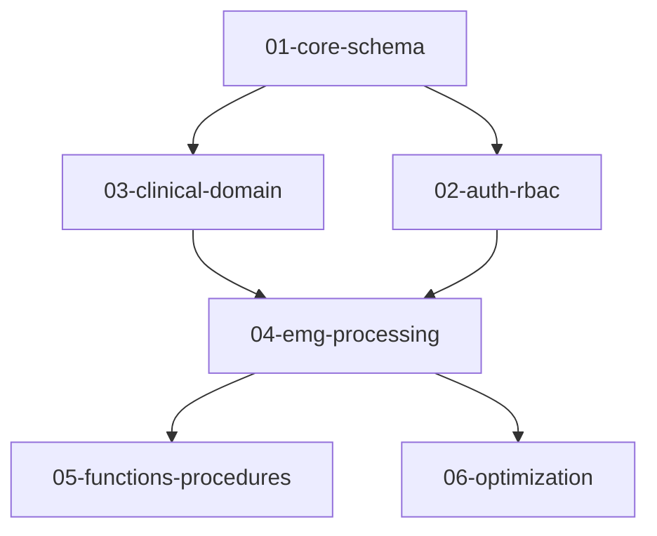

# Supabase Migration Architecture

## 📁 Migration Folder Structure

This migration system follows a domain-driven architecture with clear separation of concerns:

```
supabase/migrations/
├── 01-core-schema/           # Core database tables and relationships
├── 02-auth-rbac/             # Authentication, users, and RLS policies  
├── 03-clinical-domain/       # Clinical data models and scoring configs
├── 04-emg-processing/        # EMG-specific tables and processing logic
├── 05-functions-procedures/  # Database functions and stored procedures
├── 06-optimization/          # Performance optimizations and cleanups
├── 07-data-migrations/       # Data transformation and seed migrations
├── 99-rollbacks/            # Rollback scripts for critical migrations
└── archive/                 # Deprecated migrations (not executed)
```

## 🔄 Migration Execution Order

Migrations execute in alphabetical order by folder, then by timestamp within each folder:

### Phase 1: Core Infrastructure (01-02)
1. **01-core-schema/** - Base tables and relationships
   - `20250103000000_initial_schema_refinement.sql`
   - `20250830000000_complete_schema_setup.sql`

2. **02-auth-rbac/** - Security layer
   - `20250105000000_add_user_code_to_user_profiles.sql`
   - `20250903140000_enable_rls_rbac.sql`
   - `20250903140100_create_rls_policies.sql`
   - `20250903150000_storage_rls_policies.sql`

### Phase 2: Domain Logic (03-04)
3. **03-clinical-domain/** - Clinical features
   - `20250105000001_default_scoring_config.sql`
   - `20250902000000_update_session_settings.sql`
   - `20250902000001_update_therapy_sessions.sql`
   - `20250902000002_cleanup_session_id.sql`
   - `20250902100000_patient_scoring_config.sql`
   - `20250902110000_simplify_scoring_config.sql`
   - `20250902120000_scoring_relationships.sql`
   - `20250902130000_session_scoring_config.sql`

4. **04-emg-processing/** - EMG data processing
   - `20250131000000_mvc_workflow_alignment.sql`
   - `20250902140000_fix_duration_columns.sql`
   - `20250902180000_emg_statistics_schema.sql`
   - `20250904190000_emg_clinical_groups.sql`
   - `20250905000000_duration_ms_rename.sql`

### Phase 3: Functions & Optimization (05-06)
5. **05-functions-procedures/** - Database logic
   - `20250106000000_get_session_scoring_function.sql`

6. **06-optimization/** - Performance tuning
   - `20250904200000_cleanup_legacy_columns.sql`
   - `20250904210000_cleanup_redundant_columns.sql`
   - `20250904210001_schema_consistency_fix.sql`

### Phase 4: Data & Rollbacks (07, 99)
7. **07-data-migrations/** - Data transformations (empty - for future use)

8. **99-rollbacks/** - Emergency rollbacks
   - `20250902000000_session_settings_rollback.sql`

## 🎯 Migration Best Practices

### Naming Convention
```
YYYYMMDDHHMMSS_descriptive_name.sql
```
- **Timestamp**: Ensures execution order
- **Descriptive name**: Clear purpose using snake_case
- **Domain prefix**: Optional for clarity (e.g., `auth_`, `emg_`)

### Migration Categories

#### Core Schema (01)
- Table creation and modifications
- Primary relationships and constraints
- Core indexes

#### Auth & RBAC (02)
- User management tables
- RLS policies
- Permission structures
- Storage policies

#### Clinical Domain (03)
- Therapy sessions
- Patient management
- Scoring configurations
- Clinical workflows

#### EMG Processing (04)
- EMG data structures
- Signal processing tables
- Statistical analysis
- MVC (Maximum Voluntary Contraction) data

#### Functions & Procedures (05)
- Stored procedures
- Database functions
- Triggers
- Custom types

#### Optimization (06)
- Index optimizations
- Column cleanups
- Performance improvements
- Schema refactoring

#### Data Migrations (07)
- Data transformations
- Seed data
- Data corrections
- Bulk updates

#### Rollbacks (99)
- Critical rollback scripts
- Emergency recovery
- Version downgrades

## ⚙️ Development Workflow

### Creating New Migrations

1. **Identify the category** - Determine which folder your migration belongs to
2. **Generate timestamp** - Use current UTC time: `date -u +"%Y%m%d%H%M%S"`
3. **Create descriptive name** - Be specific about what the migration does
4. **Place in correct folder** - Based on the domain/purpose
5. **Test locally** - Run against local Supabase instance
6. **Document dependencies** - Note any required prior migrations

### Example Migration Creation
```bash
# Generate timestamp
TIMESTAMP=$(date -u +"%Y%m%d%H%M%S")

# Create migration for new clinical feature
echo "-- Description: Add new compliance metrics table
CREATE TABLE IF NOT EXISTS compliance_metrics (
  id UUID DEFAULT gen_random_uuid() PRIMARY KEY,
  session_id UUID REFERENCES therapy_sessions(id),
  metric_name TEXT NOT NULL,
  metric_value NUMERIC,
  created_at TIMESTAMPTZ DEFAULT NOW()
);" > supabase/migrations/03-clinical-domain/${TIMESTAMP}_add_compliance_metrics.sql
```

### Migration Dependencies

Some migrations depend on others. Key dependencies:



## 🚀 Deployment

### Local Development
```bash
# Reset and apply all migrations
supabase db reset

# Apply new migrations only
supabase migration up

# Check migration status
supabase migration list
```

### Production Deployment
```bash
# Deploy to linked project
supabase db push

# Verify migrations
supabase migration list --linked
```

## ⚠️ Important Notes

1. **Never modify executed migrations** - Create new migrations for changes
2. **Test rollbacks** - Ensure critical migrations have working rollbacks
3. **Backup before major changes** - Use `supabase db dump` before deployments
4. **Monitor migration performance** - Large migrations may need optimization
5. **Document breaking changes** - Update this README for schema changes

## 📋 Migration Checklist

Before creating a migration:
- [ ] Identified correct category folder
- [ ] Generated proper timestamp
- [ ] Used descriptive naming
- [ ] Tested locally
- [ ] Created rollback (if critical)
- [ ] Documented dependencies
- [ ] Updated this README (if needed)

## 🗄️ Archived Migrations

The `archive/` folder contains deprecated migrations that are no longer executed. These are kept for historical reference but should not be modified or moved back to active folders.